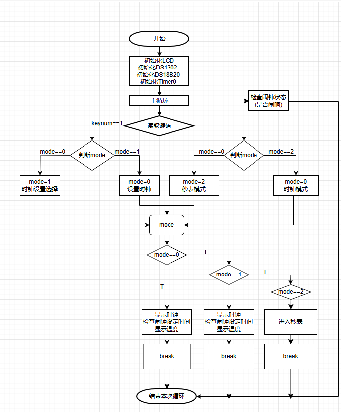

# 多功能数字钟项目

## 简介
本项目是一个基于普中51单片机试验仪的多功能数字钟设计，集成了时间显示、闹钟设置和温度检测等功能。通过使用LCD1602显示屏、DS1302实时时钟模块以及DS18B20温度传感器，实现了这些复杂的硬件交互。
### 硬件框图

### 电路原理图

### 软件功能框图

### 程序流程图

### 效果演示

[多功能数字钟效果演示](https://www.bilibili.com/video/BV12rddYmEHG/?share_source=copy_web&vd_source=6d79e808b79a669fce19cad4952ed2be)

## 主要功能
- 实时时间显示（年、月、日、时、分、秒及星期）
- 闹钟设置功能
- 温度显示功能
- 秒表功能（启动/暂停、清零）

## 硬件连接
- **LCD1602**：
  - RS -> P2.6
  - RW -> P2.5
  - EN -> P2.7
  - DataPort -> P0
- **DS1302**：
  - SCLK -> P3.6
  - IO -> P3.4
  - CE -> P3.5
- **DS18B20**：
  - DQ -> P3.7

## 软件功能
### 闹钟功能
- 通过`AlarmTime`数组设置闹钟时间。
- 在`CheckAlarm`函数中检查当前时间是否与闹钟时间匹配，匹配时触发蜂鸣器。

### 秒表功能
- 使用`StopwatchControl`函数进行秒表的控制。
- 显示秒表计时值，单位为分钟、秒和毫秒。
- 开始/暂停秒表计时，清零秒表示数。

### 温度显示功能
- 初始化DS18B20，发送转换命令并读取温度。
- 使用`DS18B20_ReadT`函数读取温度数据，并将其显示在LCD1602上。

## 按键功能
- 按键功能通过`Key`函数读取键码。
- 模式切换、时间设置、秒表控制等功能通过按键触发。

## 定时器功能
- 使用T0定时器实现100ms中断，用于控制秒表计时和闪烁效果。

## 代码结构
以下为本项目中主要的函数声明及其实现：

- **LCD1602**：
  - `LCD_Init`：初始化LCD1602显示屏。
  - `LCD_WriteCommand`：向LCD1602写入命令。
  - `LCD_WriteData`：向LCD1602写入数据。
  - `LCD_SetCursor`：设置LCD1602光标位置。
  - `LCD_ShowChar`：在指定位置显示一个字符。
  - `LCD_ShowString`：在指定位置显示字符串。
  - `LCD_ShowNum`：在指定位置显示数字。
  - `LCD_Pow`：用于LCD1602的乘方运算。

- **DS1302**：
  - `DS1302_Init`：初始化DS1302实时时钟模块。
  - `DS1302_WriteByte`：向DS1302写入一个字节。
  - `DS1302_ReadByte`：从DS1302读取一个字节。
  - `DS1302_SetTime`：设置DS1302的时间。
  - `DS1302_ReadTime`：从DS1302读取时间。

- **DS18B20**：
  - `DS18B20_Init`：初始化DS18B20温度传感器。
  - `DS18B20_ConvertT`：转换温度。
  - `DS18B20_ReadT`：读取温度。

- **单总线**：
  - `OneWire_Init`：初始化单总线。
  - `OneWire_SendBit`：发送一位数据。
  - `OneWire_ReceiveBit`：接收一位数据。
  - `OneWire_SendByte`：发送一个字节数据。
  - `OneWire_ReceiveByte`：接收一个字节数据。

- **时间设置**：
  - `TimeSet`：用于时间设置功能。
  - `TimeShow`：用于时间显示功能。

- **秒表**：
  - `StopwatchControl`：用于秒表控制。
  - `ShowStopwatch`：用于显示秒表示数。

- **蜂鸣器**：
  - `Timer0_Routine`：定时器中断服务程序，控制蜂鸣器鸣叫和秒表示数更新。

## 注意事项
- 请确保所有硬件连接正确无误。
- 在实际使用中，可能需要根据具体的单片机型号和开发环境进行适当的调整。
- 温度传感器DS18B20的读取可能需要根据实际温度范围和精度进行优化。

## 编译与烧录
使用Keil uVision或其他兼容的51单片机开发环境进行编译，将生成的HEX文件烧录到单片机中进行测试。
